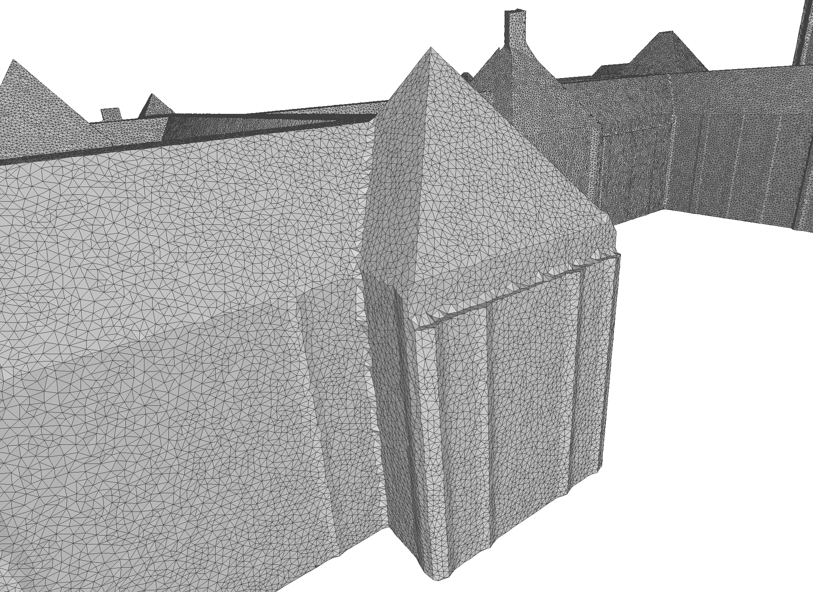
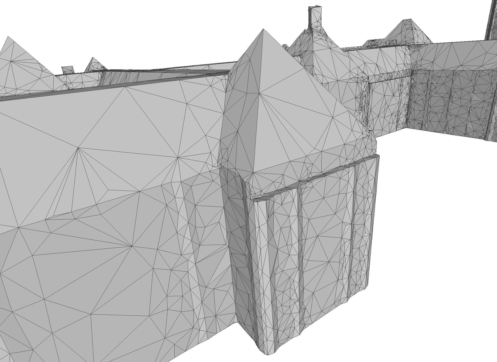

# Thesis C++ - `alpha_wrap_cli`

This repository contains `alpha_wrap_cli`, a command-line tool implementing an extension of CGAL’s 3D Alpha Wrap algorithm.

The extension adds a `tau`-based local refinement criterion and a vertex insertion strategy to better preserve sharp concave features. It applies extra refinement only where the generated wrap deviates too far from the input geometry, avoiding the need for a globally smaller `alpha`.

The extension retains the guarantees of the original algorithm: termination, strict enclosure of the input, watertightness, orientability, and manifoldness.

## Comparison

<table>
  <tr>
    <td align="center">
      <br>
      <sub>Original 3D Alpha Wrap</sub>
    </td>
    <td align="center">
      <br>
      <sub>Extended Alpha Wrap (`tau` refinement)</sub>
    </td>
  </tr>
</table>

## Clone

`masbcpp` is included as a git submodule in `external/masbcpp`, so clone with submodules:

```bash
git clone --recurse-submodules <repo-url>
```

If you already cloned without submodules:

```bash
git submodule sync --recursive
git submodule update --init --recursive
```

## Prerequisites

- CMake (>= 3.16)
- C++20 compiler
- CGAL
- `val3dity` (required when using `--validate` or `--wrap_invalid_only`)

## Build

From the repository root:

```bash
cmake -S . -B build -DCMAKE_BUILD_TYPE=Release
cmake --build build --target alpha_wrap_cli
```

Note: `alpha_wrap_cli` build still configures the full project, which expects the `external/masbcpp` submodule to be present.

If `val3dity` is not on your `PATH`, provide it explicitly:

```bash
cmake -S . -B build -DCMAKE_BUILD_TYPE=Release -DVAL3DITY_EXECUTABLE=/path/to/val3dity
```

## Run

```bash
./build/alpha_wrap_cli <input_path> <output_path> <alpha> <offset> <tau> [--validate] [--wrap_invalid_only] [--use_noprmal_alpha_wrap]
```

Example:

```bash
./build/alpha_wrap_cli ./example_data/input/3DBAG_aula.obj ./example_data/output/aula.obj 10 0.1 1.5 --validate
```

## Notes

- `alpha` and `offset` are absolute values.
- If a mesh input is not triangulated, the CLI triangulates it automatically before wrapping.
- `--validate` runs val3dity-based validation and repair loops.
- `--wrap_invalid_only` also uses val3dity to detect invalid groups before wrapping.
- `--use_noprmal_alpha_wrap` uses the CGAL overload without the `tau` parameter.
- Missing `val3dity` does not block compilation; it is required at runtime only when using `--validate` or `--wrap_invalid_only`.

## Troubleshooting

If CMake fails with an error like:

`No download info given for 'masbcpp_ext' ... external/masbcpp ... is not an existing non-empty directory`

initialize the submodule and reconfigure:

```bash
git submodule sync --recursive
git submodule update --init --recursive
cmake -S . -B build -DCMAKE_BUILD_TYPE=Release
```
